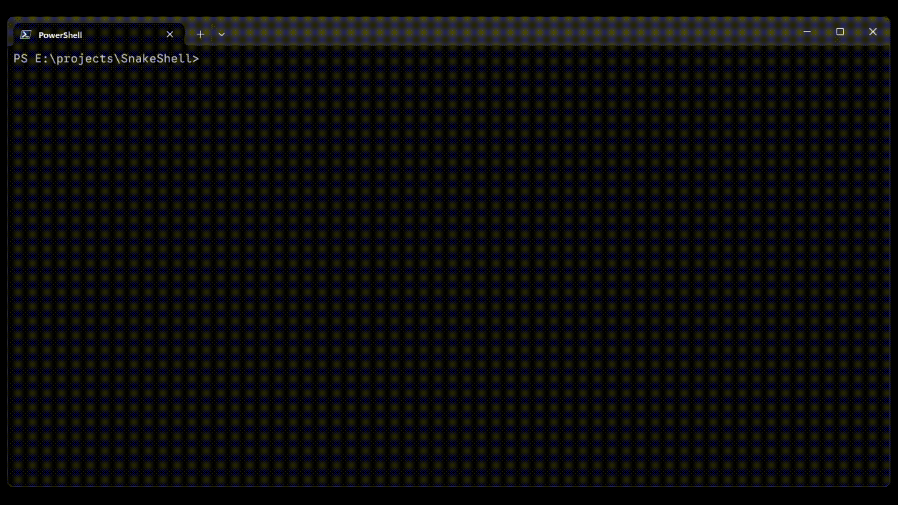

# SnakeShell

> The classic [Snake game](<https://en.wikipedia.org/wiki/Snake_(video_game_genre)>) but in a shell environment.



### Installation

Here are the steps to install `snakeshell` game in your terminal:

1. Download the Rust language from https://www.rust-lang.org/tools/install
2. Run the following command in ternminal to install snakeshell:

```sh
cargo install snakeshell
```

3. Run `snakeshell` cmd and enjoy the game

### Game Controls

| **Key** | **Action** |
| :-----: | :--------: |
|   `W`   |  Move Up   |
|   `A`   | Move Left  |
|   `S`   | Move Down  |
|   `D`   | Move Right |
| `Enter` |  Confirm   |
|  `Esc`  |    Exit    |
